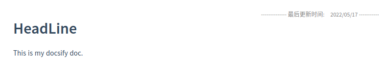
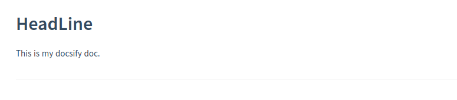

# docsify-updated

  [](https://www.jsdelivr.com/package/npm/docsify-updated)

Add update time for each of your docsify markdown ([English](./README.md)/[中文](./zh-README.md)).

## Install

add js CDN to `index.html`

```javascript
<script src="https://cdn.jsdelivr.net/npm/docsify-updated/src/time-updater.min.js"></script>
```

or

```javascript
<script src="https://cdn.jsdelivr.net/npm/docsify-updated/src/time-updater.js"></script>
```

## Usage

Add javasript to `index.html`, and you can modify the content of the text field arbitrarily

```javascript
window.$docsify = {
  timeUpdater: {
    text: ">last update time: {docsify-updated}",
    formatUpdated: "{YYYY}/{MM}/{DD}",
    whereToPlace: "bottom",  // "top" or "bottom", default to "bottom"
  },
};
```

or

```javascript
window.$docsify = {
  timeUpdater: {
    text: ">最后更新时间: {docsify-updated}",
    formatUpdated: "{YYYY}/{MM}/{DD}",
    whereToPlace: "bottom",  // "top" or "bottom", default to "bottom"
  },
};
```

## Parameter

|     Field     | Describe                            | Detail                                                       |
| :-----------: | ----------------------------------- | ------------------------------------------------------------ |
|     text      | label style to show                 | *text* stores the style and content before the *formatUpdated* |
| formatUpdated | updated time format and it's suffix | *formatUpdated* stores time formated and it's suffix, eg. {YYYY}/{MM}/{DD} by Author |
| whereToPlace  | where the label is placed           | "top" or "bottom", default to "bottom"                       |

## Time Patterns

please see [https://github.com/lukeed/tinydate#patterns](https://github.com/lukeed/tinydate#patterns)

- `{YYYY}`: full year; eg: **2017**
- `{YY}`: short year; eg: **17**
- `{MM}`: month; eg: **04**
- `{DD}`: day; eg: **01**
- `{HH}`: hours; eg: **06** (24h)
- `{mm}`: minutes; eg: **59**
- `{ss}`: seconds; eg: **09**
- `{fff}`: milliseconds; eg: **555**

## Nested

modify `timeUpdater.text` to nest HTML

```javascript
window.$docsify = {
  timeUpdater: {
    text: "<div align='center'>last update time: {docsify-updated}</div>",
    formatUpdated: "{YYYY}/{MM}/{DD}",
  },
};
```


or

```javascript
window.$docsify = {
  timeUpdater: {
    text: "<div align='center' width='200px' style='color:gray;font-size:10px'>-------------- 最后更新时间:&emsp;{docsify-updated} --------------</div>",
    formatUpdated: "{YYYY} 年 {MM} 月 {DD} 日",
  },
};
```


## Location

choose where to place it by `timeUpdater.whereToPlace`

```javascript
window.$docsify = {
  timeUpdater: {
    text: "<div align='center' width='200px' style='color:gray;font-size:10px'>-------------- 最后更新时间:&emsp;{docsify-updated} --------------</div>",
    formatUpdated: "{YYYY}/{MM}/{DD}",
    whereToPlace: "top"  // "top" or "bottom", default to "bottom"
  },
};
```



## Question

### 1. Modify a single document, all document updated time has been modified?

In the process of using any CI/CD method, if you automatically pull the `git` documentation and deploy `docsify`, you may encounter the `.md` file update time is set to the CI/CD time of `git clone your_repo` during this process.

This will cause the plugin to display the wrong time when the file is updated (the plugin's display time is the last update time of each file).

**Repair method**

It is recommended to use `git` to fix file update times during deployment of docsify documentation (automatically or manually).

For example to manually deploy the document:

```shell
# clone repo
git clone https://github.com/your_repo.git

# cd dir
cd your_repo_dir

# repair file update time
git ls-files | while read file; do touch -d $(git log -1 --format="@%ct" "$file") "$file"; done

# Start the docsify service
docsify serve docs/
```

## Various Styles

demo: **english**

```javascript
window.$docsify = {
  timeUpdater: {
    text: ">Last Modify: {docsify-updated}",
    formatUpdated: "{YYYY}/{MM}/{DD}",
  },
};
```


demo: **chinese**

```javascript
window.$docsify = {
  timeUpdater: {
    text: ">最后更新时间: {docsify-updated}",
    formatUpdated: "{YYYY}/{MM}/{DD}",
  },
};
```


demo: **another style**

```javascript
window.$docsify = {
  timeUpdater: {
    text: "---\nlast update time: {docsify-updated}",
    formatUpdated: "{YYYY}/{MM}/{DD}",
  },
};
```



demo: **bottom left**

```java
window.$docsify = {
  timeUpdater: {
    text: "<div align='left' width='200px' style='color:gray;font-size:16px'>Posted @ {docsify-updated}</div>",
    formatUpdated: "{YYYY}-{MM}-{DD} {HH}:{mm}",
  },
};
```


