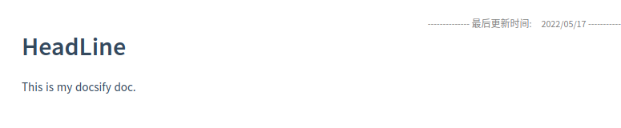
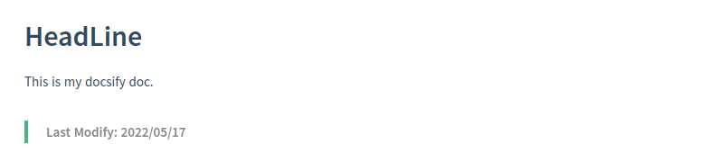
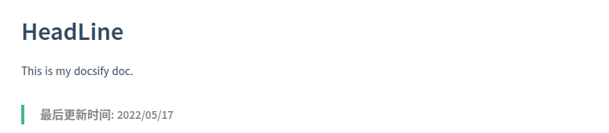
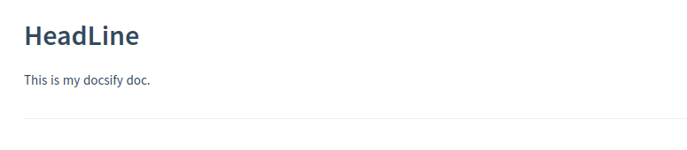

# docsify-updated

  [](https://www.jsdelivr.com/package/npm/docsify-updated)

为您的每个 docsify markdown 文档增加更新时间 ([English](./README.md)/[中文](./zh-README.md)).

## 安装

添加 js CDN 到 `index.html`

```javascript
<script src="https://cdn.jsdelivr.net/npm/docsify-updated/src/time-updater.min.js"></script>
```

或者

```javascript
<script src="https://cdn.jsdelivr.net/npm/docsify-updated/src/time-updater.js"></script>
```

## 使用

向 `index.html` 添加 js 脚本，可以根据规则修改参数内容

```javascript
window.$docsify = {
  timeUpdater: {
    text: ">last update time: {docsify-updated}",
    formatUpdated: "{YYYY}/{MM}/{DD}",
    whereToPlace: "bottom",  // "top" or "bottom", default to "bottom"
  },
};
```

或者

```javascript
window.$docsify = {
  timeUpdater: {
    text: ">最后更新时间: {docsify-updated}",
    formatUpdated: "{YYYY}/{MM}/{DD}",
    whereToPlace: "bottom",  // "top" or "bottom", default to "bottom"
  },
};
```

## 插件参数

|     参数      | 描述                         | 详情                                                         |
| :-----------: | ---------------------------- | ------------------------------------------------------------ |
|     text      | 将要展示标签的样式           | *text* 存放并渲染 *formatUpdated* 之前的内容                 |
| formatUpdated | 更新时间的格式，与之后的内容 | *formatUpdated* 指定时间格式，与该标签之后的内容，eg. {YYYY}/{MM}/{DD} by 作者名 |
| whereToPlace  | 插件摆放位置                 | "top" 或 "bottom", 默认 "bottom"                             |

## 时间格式

请查看 [https://github.com/lukeed/tinydate#patterns](https://github.com/lukeed/tinydate#patterns)

- `{YYYY}`: 年; eg: **2017**
- `{YY}`: （缩略）年; eg: **17**
- `{MM}`: 月; eg: **04**
- `{DD}`: 日; eg: **01**
- `{HH}`: 小时; eg: **06** (24h)
- `{mm}`: 分; eg: **59**
- `{ss}`: 秒; eg: **09**
- `{fff}`: 毫秒; eg: **555**

## 内嵌 HTML

修改 `timeUpdater.text` 以内嵌 HTML

```javascript
window.$docsify = {
  timeUpdater: {
    text: "<div align='center'>last update time: {docsify-updated}</div>",
    formatUpdated: "{YYYY}/{MM}/{DD}",
  },
};
```


或者

```javascript
window.$docsify = {
  timeUpdater: {
    text: "<div align='center' width='200px' style='color:gray;font-size:10px'>-------------- 最后更新时间:&emsp;{docsify-updated} --------------</div>",
    formatUpdated: "{YYYY} 年 {MM} 月 {DD} 日",
  },
};
```


## 位置

设置 `timeUpdater.whereToPlace` 来决定插件拜访的位置

```javascript
window.$docsify = {
  timeUpdater: {
    text: "<div align='center' width='200px' style='color:gray;font-size:10px'>-------------- 最后更新时间:&emsp;{docsify-updated} --------------</div>",
    formatUpdated: "{YYYY}/{MM}/{DD}",
    whereToPlace: "top"  // "top" or "bottom", default to "bottom"
  },
};
```



## 样例

demo: **英文**

```javascript
window.$docsify = {
  timeUpdater: {
    text: ">Last Modify: {docsify-updated}",
    formatUpdated: "{YYYY}/{MM}/{DD}",
  },
};
```



demo: **中文**

```javascript
window.$docsify = {
  timeUpdater: {
    text: ">最后更新时间: {docsify-updated}",
    formatUpdated: "{YYYY}/{MM}/{DD}",
  },
};
```



demo: **其他样式**

```javascript
window.$docsify = {
  timeUpdater: {
    text: "---\nlast update time: {docsify-updated}",
    formatUpdated: "{YYYY}/{MM}/{DD}",
  },
};
```



demo: **左下摆放**

```java
window.$docsify = {
  timeUpdater: {
    text: "<div align='left' width='200px' style='color:gray;font-size:16px'>Posted @ {docsify-updated}</div>",
    formatUpdated: "{YYYY}-{MM}-{DD} {HH}:{mm}",
  },
};
```


